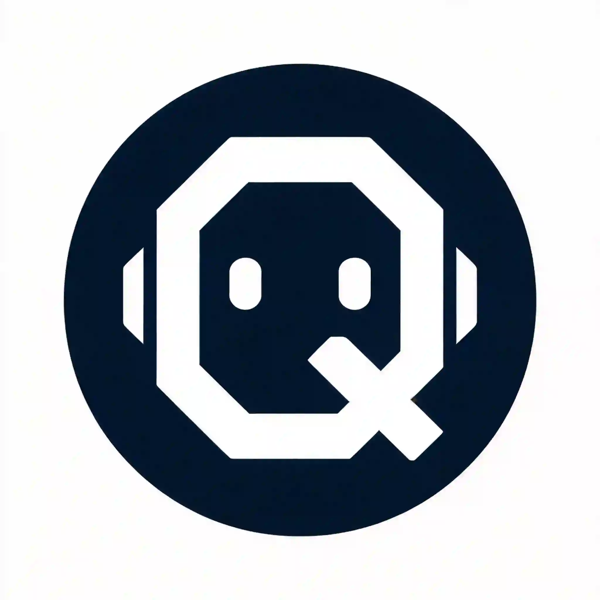
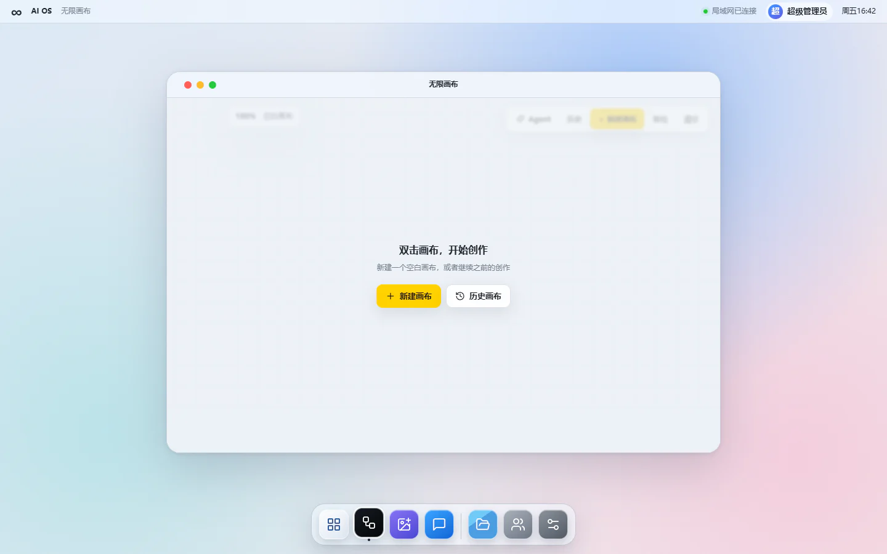
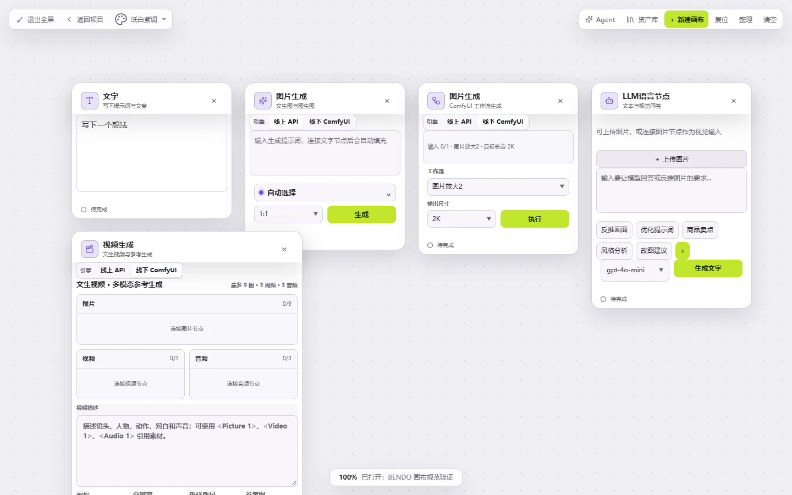
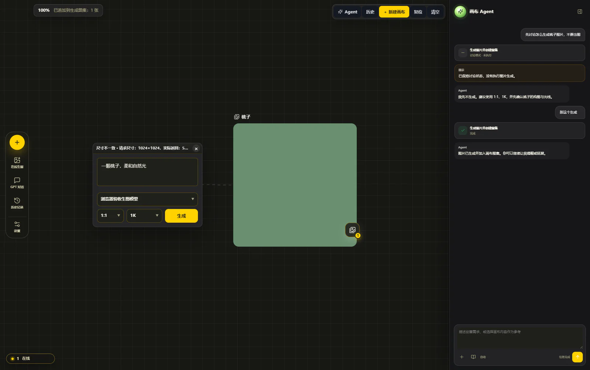
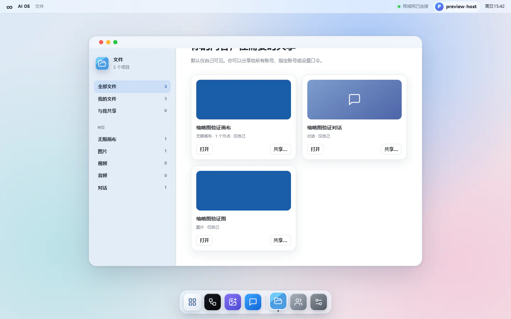
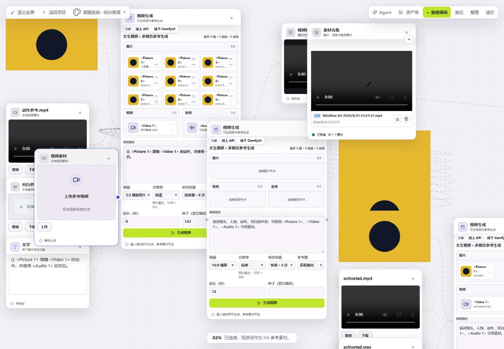
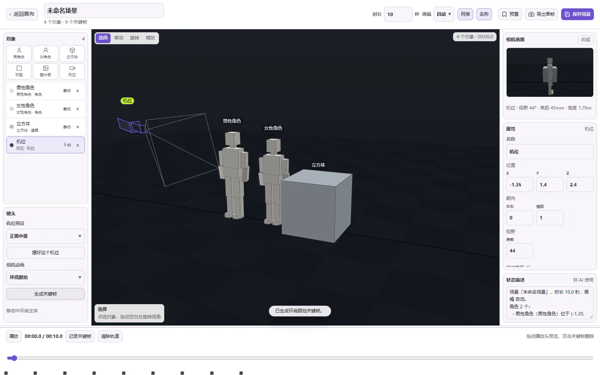

<div align="center">
  
  <h1>SuperQAI · AI OS</h1>
  <p><strong>一台 Windows 主机，一套可随身部署的本地 AI 创作操作系统。</strong></p>
  <p>无限画布、AI 生图、对话、视频、文件共享、账户与更新，在同一个桌面中完成。</p>
  <p>
    <a href="https://github.com/Qlh430/SuperQAI/releases/latest"></a>
    <a href="https://github.com/Qlh430/SuperQAI/releases"></a>
    <a href="https://github.com/Qlh430/SuperQAI/stargazers"></a>
    
  </p>
</div>



## 下载即用

首次使用只需要下载最新 Release 中的 **Portable** 包：

1. 打开 [Releases](https://github.com/Qlh430/SuperQAI/releases/latest)。
2. 下载 `AI-OS-Portable-<版本>-win-x64.zip`。
3. 解压到固定目录，运行 `AI OS.exe`。
4. 在主机电脑创建超级管理员，再为其他设备分配账号。
5. 局域网设备通过浏览器访问系统设置中显示的地址，例如 `http://192.168.1.10:3199`。

Portable 包已经携带 Electron 和 Node 24，目标电脑不需要安装 Node，也不需要单独配置开发环境。已有安装可通过应用内更新获取新版本。

## 核心能力

| 模块 | 能做什么 |
| --- | --- |
| **无限画布** | 使用节点连接文字、图片、视频、音频、LLM、ComfyUI、Midjourney 和复杂工作流；支持缩放、整理、历史、素材库与多人协作。 |
| **画布 Agent** | 直接描述目标，Agent 会读取当前画布、选择 Skill、调用真实模型与工作流，并把结果写回画布；支持生图、修图、识图、抠图、放大和视频生成。 |
| **AI 生图与媒体** | 文生图、图生图、遮罩编辑、高清放大、抠图、MiniMax H3 视频、API 视频、素材集合和本地历史管理。 |
| **文件** | 统一管理画布、图片、视频、音频和对话资源；内容可保持私有，也可共享给所有账号、指定账号或使用口令访问。 |
| **多设备协作** | 一台主机集中运行模型配置、数据与任务，其他电脑、平板或手机只需浏览器登录；画布支持多账号实时协作。 |
| **本地优先与运维** | API Key 在本机加密保存，账户、画布、媒体和备份相互隔离；支持备份恢复、开机自启、托盘运行、便携部署和增量更新。 |

## 界面预览

<table>
  <tr>
    <td width="50%">
      
      <br /><strong>节点式无限画布</strong><br />
      把文字、图片、视频、模型和工作流放在同一张画布上。
    </td>
    <td width="50%">
      
      <br /><strong>画布 Agent</strong><br />
      用自然语言完成任务，结果直接进入当前画布。
    </td>
  </tr>
  <tr>
    <td width="50%">
      
      <br /><strong>文件</strong><br />
      集中查看画布、图片、视频、音频和对话资源。
    </td>
    <td width="50%">
      
      <br /><strong>视频与多模态工作流</strong><br />
      图片、视频、音频和文字可以在节点之间组合传递。
    </td>
  </tr>
  <tr>
    <td width="50%">
      
      <br /><strong>3D 导演台</strong><br />
      摆放角色、相机和道具，生成镜头关键帧并保存场景。
    </td>
    <td width="50%">
      
      <br /><strong>桌面式工作空间</strong><br />
      Dock、浮动窗口、应用切换和账户级外观设置。
    </td>
  </tr>
</table>

## 产品定位

AI OS 面向需要长期积累素材、在本地管理模型与数据的个人和小团队：

- 生成任务、画布和账号数据都保存在自己的主机，不依赖公共云盘。
- 一个主机服务同时承担模型配置、任务执行、文件保存和局域网访问。
- 普通账号相互隔离；只有明确共享的资源才会出现在其他人的“与我共享”中。
- 便携包可以在其他 Windows 电脑解压运行，也可以继续通过 GitHub Release 更新。

## 从源码运行

适合开发和定制。普通用户请优先使用上面的 Portable 包。

### 第一次安装

要求：Windows 10/11、Node.js 24.13 或更高的 Node 24 版本。

```powershell
npm install
```

账号、文件、共享和本地画布不依赖 AI 密钥。首次登录后，由超级管理员在“系统设置 → API 设置”中配置模型站点、Base URL、协议、API Key、模型能力与顺序。已有 `.env` 或 `data/settings.json` 中的旧 API 配置会在第一次升级启动时自动导入一次；迁移成功后它们不再作为运行期模型配置源。

安装桌面与开始菜单图标：

```powershell
.\install-host-shortcut.ps1
```

之后双击桌面的 **AI OS Host** 即可。首次打开时，在主机电脑上创建超级管理员；这个入口在管理员创建后会永久关闭，局域网设备不能创建超级管理员。

也可在项目目录双击 `start.bat`。若 Electron 已安装，它启动桌面程序；否则退回浏览器模式。

### 开发热刷新

用 `npm run desktop:start` 启动源码开发模式时，AI OS 会自动监听项目代码，不需要每次退出并重启整个桌面程序：

| 修改内容 | 自动处理 |
| --- | --- |
| CSS | 原位替换样式，不刷新页面，不重置画布 |
| 前端 HTML / JavaScript | 自动刷新渲染页面，并恢复当前应用、画布、缩放、平移、节点选择和画布 Agent 面板 |
| 服务端 JavaScript / `.env` | 只重启本地 Node 服务子进程，等待服务就绪后刷新渲染页面 |
| Electron 主进程 / `package.json` | 自动重启 AI OS 主进程 |

`data`、`output`、`logs`、`dist`、`node_modules`、构建产物和临时文件不会触发热刷新。热刷新只是源码开发工具，不会在便携包或 GitHub 更新包中启用；正式包内只保留一个用于兼容旧版更新的空文件，不包含监听、自动刷新或自动重启逻辑。

源码模式默认开启热刷新。需要手动关闭时使用：

```powershell
npm run desktop:start:no-reload
```

也可以运行 `npm run desktop:start -- --no-dev-reload`，或先设置 `$env:AI_OS_DEV_RELOAD='0'` 再启动。关闭后修改代码不会自动刷新，需要按 `Ctrl + R` 刷新页面；服务端或主进程代码仍需重新启动。

## 日常使用

1. 主机开机后启动 **AI OS Host**。关闭主窗口只会缩到系统托盘，服务仍继续运行；托盘菜单中的“退出并停止服务”才会完全退出。
2. 超级管理员进入“账户管理”，创建普通账号，并把一次性临时密码交给对应使用者。
3. 普通用户首次登录后必须修改密码。
4. 其他设备在同一局域网中打开“系统设置”显示的地址，例如 `http://192.168.1.10:3199`，再用分配的账号登录。
5. 资源默认私有。需要协作时，在“文件”或资源卡片的共享设置中选择共享范围与权限。

### API 设置

只有超级管理员能打开“系统设置 → API 设置”。一个站点内统一保存站点协议、密钥和模型；每个模型可分配对话、识图、工具、生图、修图、视频或音频能力。站点和模型的显示顺序就是系统的确定性选择顺序。

- “验证协议”“拉取模型”和模型行的“测试”都是手动操作，只有点击时才访问上游。
- 模型 ID 使用接口目录中的原始 ID，加入后只读；更换模型请移除后重新添加，不再单独设置显示名称。节点列表用平台名称区分同名模型。已记录上游映射的旧平台后缀会在启动时先备份再迁移，旧画布引用保持兼容；接口原本带有后缀的 ID 不会被直接裁剪。
- “自动回退”开启时，未固定模型的请求才会按管理员顺序尝试下一个兼容模型；明确指定的站点或模型不会悄悄切换。
- 图片节点选择“自动选择”时，接口明确拒绝请求并提示余额或额度不足，会继续尝试已配置的下一个兼容模型，不会反复重试同一个失败候选。修图只选择支持修图的模型；没有兼容备用项时仍会提示失败。已返回任务 ID、正在查询结果或提交状态不明时不会切换重发，以免重复扣费。这与“网络线路”的自动选择是两套独立逻辑。
- 系统不会后台轮询所有 API、按历史延迟重新排序，也不维护 Provider 熔断状态。
- API Key 只提交到主机并加密保存，之后输入框保持为空；浏览器和普通账号都无法取回完整密钥。

### Skill 管理

超级管理员进入“系统设置 → Skill 管理”，按“对话与文本 / 图像 / 视频 / 音频”四类查看画布 Agent 可用的 Skill，并逐个启用或停用。

- **系统 Skill** 随应用部署在项目的 `skills` 目录，普通用户看不到也不能删除；停用后画布 Agent 不会再自动激活它，界面上的技能选择器也会同步消失。
- **功能 Skill** 存放在 `data/skills`（可用 `AI_OS_SKILLS_DIR` 指定其他目录），同名目录会覆盖系统 Skill，便于按站点定制同一套流程。
- 启用状态保存在 `data/skills.json`：默认全部启用，停用会写入 `enabled.<id> = false`，重新启用会移除该覆盖项。
- Skill 只影响画布 Agent 的专业能力路由，不影响在节点上手动选模型、手动生图或手动执行工作流。

内置 14 个系统 Skill，每个 Skill 声明的能力都对应画布上真实存在的工具，不存在只有说明没有执行的空壳：

| Skill | 界面名称 | 实际执行的能力 |
| --- | --- | --- |
| `writing` `rewrite` `code` `analysis` | 写作生成、文本改写、代码助手、文本分析 | 文字节点与 LLM 节点（官方预设） |
| `generate-image` | 生成图片 | `generate_image_to_gallery` 一步完成生图并进图集 |
| `edit-image` | 编辑图片 | 图生图编辑、遮罩编辑与按比例裁切 |
| `upscale-image` | 放大图片 | ComfyUI 放大节点（TTP 2K/4K/6K、SeedVR2 2K/4K） |
| `describe-image` | 识别图片 | 识图 LLM 节点：看图、反推提示词、校验图片 |
| `remove-background` | 一键抠图 | 本地 ONNX 抠图（无需显卡）或 ComfyUI 抠图工作流，结果落成新的透明图片节点 |
| `poster-design` `ecommerce-image-set` `product-refinement` `social-media-pack` | 海报设计、电商套图、产品精修、社媒多尺寸 | 组合上述原子能力完成成套图片 |
| `image-to-video` | 图片转视频 | MiniMax H3 视频节点 |

自动模式下，生图、编辑图片、放大图片、识别图片、抠图五类需求会先激活对应的能力 Skill，再按 Skill 里的流程调用真实工具；激活步骤由运行层自动衔接，不需要用户额外确认。

### ComfyUI 配置

超级管理员进入“系统设置 → ComfyUI”，不再从 API 设置配置 ComfyUI。

- **远程连接**：只填访问地址，例如 `http://192.168.1.53:8188`，测试后保存。在另一台电脑上的 ComfyUI 需要先在那台电脑启动；共享目录或文件路径不能代替远程启动服务。
- **本机托管**：ComfyUI 与 AI OS **服务**部署在同一台电脑时，填写 ComfyUI 根目录、监听 IP 和端口。常见整合包/虚拟环境会在保存时识别 Python 和 `main.py`，也可以点击“识别路径”；特殊安装在高级设置手动填写。支持可选输出目录，不安装 Python、依赖或模型。
- “保存并启动”使用当前表单，状态接口可访问后才显示运行中。可查看最近启动日志并停止托管进程；不会接管或停止原本就在运行的外部 ComfyUI。停止进程会中断它的任务。
- “本机”指 AI OS 服务主机，不是打开页面的浏览器电脑。其他局域网电脑通过 AI OS 使用时，ComfyUI 监听 `127.0.0.1` 即可；需要直接访问 ComfyUI 页面时才使用 `0.0.0.0` 或主机局域网 IP，并自行放行防火墙端口。
- 现有 ComfyUI 连接及工作流保留；多个连接可在此切换，保存的连接用于默认工作流。明确选择的提供商或显式任务地址不受默认值覆盖。关闭 AI OS 窗口缩到托盘不会停止服务；“退出并停止服务”会停止 AI OS 启动的 ComfyUI。
- 测试连接只读取状态接口，不提交生图或视频工作流。

### 抠图

在画布上右键图片（含图集里的图片）选择“AI 抠图”，或让画布 Agent 执行“抠图 / 去背景”，都会打开同一个抠图工作台。工作台分主体模式和特效模式（按颜色抠图），结果作为新的图片节点落在原图右侧，原图保留不动。

- **本地抠图**：用 BEN2 Base ONNX 在本机 CPU 上推理，不需要 ComfyUI、不需要显卡，也不消耗 API 额度。首次推理约十几秒，同一张图会复用缓存。
- **权重从哪来**：权重约 213MB，随应用内置在 `assets/models/background-removal/ben2-base-1.0.0.onnx`（`assets` 会一起打进便携包），启动即用，**不需要下载、也不需要 ComfyUI**。加载前按大小与 sha256 校验，读的是应用目录里的那一份，不会往 `data` 目录复制副本，所以界面上没有“下载模型”这一步。想改装在其他位置的权重，在 `.env` 里设置 `AI_OS_BACKGROUND_REMOVAL_MODEL_PATH`（优先于内置权重，例如 `F:\DXOS-Portable-0.2.0-win-x64\data\models\background-removal\ben2-base-1.0.0.onnx`）；内置权重被人为删掉/改坏时，工作台会提示不可用并给出“导入本地模型”的兜底入口。
- **模型出处**：BEN2（Background Erase Network, arXiv:2501.06230）由 Prama LLC 开源，权重取自官方 HuggingFace 仓库 `PramaLLC/BEN2` 的 `BEN2_Base.onnx`，sha256 与官方发布完全一致、未做改动，许可是 MIT。预处理/后处理按官方 `onnx_run.py` 实现（1024 定尺、0–1 归一化、min-max 拉伸）；官方可选的 `refine_foreground` 精修步骤需要另外的 PyTorch 权重，没有移植。
- **模型更新**：在「设置 → 本地模型」里检查上游官方发布源（`PramaLLC/BEN2`）并下载更新。新权重存到 `data/models/background-removal`，优先于内置那份生效；下载会按上游公布的 sha256 校验，校验不过整份丢弃，内置文件永远不被改写。想回退就点「恢复内置版本」，删掉数据目录里的副本即可。生效优先级是：`.env` 指定的路径 > 数据目录里的更新/导入副本 > 随应用内置。国内网络连不上 `huggingface.co` 时，可以用 `AI_OS_BACKGROUND_REMOVAL_UPSTREAM_URL`、`AI_OS_BACKGROUND_REMOVAL_UPSTREAM_META_URL`、`AI_OS_BACKGROUND_REMOVAL_DOWNLOAD_URL` 指向镜像；下载走的是和生图请求同一套直连/代理自动切换。
- **ComfyUI 抠图**：在画布新建 ComfyUI 节点，把“工作流”选成“抠图 · ComfyUI”，连接一张图片后点“执行”。不绑定特定插件：AI OS 读取目标 ComfyUI 实际安装的节点，自动挑一个抠图节点（ComfyUI-RMBG、ComfyUI-BiRefNet 等）并当场组装工作流；目标 ComfyUI 没装抠图节点时会提示安装对应插件。也可以在 `workflows/background-removal.json` 放一份自备工作流，系统会优先使用它。
- 两条路线都不需要用户写 JSON：实体参数、边缘收缩扩张、边缘羽化和特效阈值都在工作台或节点上直接调，不满意点“恢复默认”即可回到默认值。

### 全局外观与显示缩放

“系统设置 → 外观”提供浅色、深色和跟随系统三种全局外观，以及 75%、100%、125%、150%、175% 五档显示比例。外观会统一覆盖桌面、菜单栏、Dock、应用窗口、表单与无限画布；无限画布不再保存独立主题，而是始终跟随系统实际主题。

外观与显示比例按账号保存。刷新页面或重新登录后会恢复当前账号的选择，不同账号之间互不覆盖。显示比例只作用于登录后的 AI OS 桌面，不修改浏览器缩放或 Windows DPI，登录页始终保持 100%。

桌面操作和普通 Mac 应用一致：点击 Dock 图标打开或聚焦应用，拖动标题栏移动窗口，拖动四边/四角调整大小，双击标题栏最大化/恢复；黄色按钮最小化，红色按钮关闭（关闭后仍可从 Dock 重新打开，应用内容不会被销毁）。宽度小于 860px 的浏览器会自动切换为单窗口模式。

“开机自动启动”可以在系统设置或托盘菜单中随时开启/关闭。开启后，Windows 登录时会静默启动主机程序并驻留托盘；关闭后不会修改账号数据，也不会卸载程序。

## 数据和备份

开发运行时默认数据目录是项目内的 `data`：

- `data/system.sqlite`：账户、会话、资源、共享和审计数据。
- `data/system.sqlite` 中的 Provider 表：唯一的模型站点、模型能力和顺序配置。
- `data/security/provider-master.key`：用于解密 Provider 密钥的本机主密钥。
- `data/users/<用户ID>/`：每个账号独立的历史数据。
- `data/canvas.db`：画布内容。
- `output/`：生成的图片和视频。
- `data/backups/`：系统设置中创建的备份快照。

备份会生成校验清单，并把 `system.sqlite` 与 `data/security/provider-master.key` 作为同一个恢复单元。正式使用建议把整个 `data/backups` 定期复制到另一块硬盘或 NAS；主机硬盘故障时，仅保存在同一块盘上的备份无法提供保护。

恢复前系统会校验清单与 SHA-256，并创建恢复前快照。恢复后需要重启主机服务。只要数据库含有加密 Provider 密钥而备份缺少主密钥、主密钥长度不正确或文件损坏，系统就会拒绝该恢复；如果运行目录中的主密钥意外丢失，模型服务会安全锁定，但账户、桌面和文件仍可进入。此时应恢复一份同时包含数据库和主密钥的完整快照。

升级迁移不会删除 `.env`、旧 `settings.json`、旧监测历史或旧 Agent 路由历史。需要回滚时，先停止主机服务，再恢复自动生成的迁移前快照并使用升级前程序版本；不要把新数据库与另一份备份的主密钥混合。旧文件的永久清理由管理员另行手动决定。

## 网络与安全

### API 自动网络线路

“API 设置 → 网络线路 → 自动选择”由运行 AI OS 主机服务的电脑处理。局域网其他电脑仅在浏览器中访问 AI OS 时，开启它们自己的代理不会成为主机的出站代理。

- 自动发现依次检查代理环境变量、Windows 显式系统代理、常见本机端口。候选需要通过当前目标站点的 HTTP CONNECT 或 SOCKS5 握手，端口打开本身不代表代理可用。
- 支持 HTTP、HTTPS、SOCKS5 和 SOCKS5h 代理；扫描到 SOCKS5 端口时使用 SOCKS5h，让代理解析目标域名。失败候选按目标站点短暂排除，后续请求会重新发现；不会把另一台电脑的运行期路由状态带过来。
- 未有成功记录的站点优先直连；自动模式会依据成功记录和连接失败选择线路。拉取模型、下载图片等只读请求可以回退；计费生成仅在明确尚未提交时重试，提交状态不确定时不会自动重发。计费请求不自动跟随 HTTP 重定向，需使用平台提供的最终 API 地址。
- 不执行 PAC 自动配置脚本，也不保证发现所有自定义端口。代理客户端仅启动、但没有可发现的 HTTP/SOCKS 入口时，可开启其系统代理，或在主机 `.env` 中设置 `OUTBOUND_PROXY_URL=http://127.0.0.1:实际端口` / `socks5h://127.0.0.1:实际端口` 后重启服务；恢复自动发现则设为 `auto`。
- 检测代理入口不等于保证上游 API 可用；代理节点故障、规则拦截、API 鉴权或服务端异常仍需分别排查。程序不修改代理客户端的节点、规则或系统代理设置。

### 局域网访问与密钥

- 系统只设计给可信局域网使用；不要直接把 3199 端口暴露到公网。
- Windows 防火墙首次询问时，只允许“专用网络”。
- 生产环境应给主机设置固定局域网 IP，或在路由器中做 DHCP 地址保留。
- API Key 只能在主机“模型服务”中配置，并由本机 Vault 加密；不要写进前端、聊天或说明文件，也不要随便复制带数据的安装包。
- 登录 Cookie 使用 `HttpOnly` 与 `SameSite=Lax`；密码只保存为带随机盐的 scrypt 哈希。

## 开发与校验

```powershell
npm run desktop:start
npm run check:system
npm run check:auth
npm run check:resources
npm run check:backup
npm run check:ai-os-shell
npm run desktop:check
npm run check:ai-os
npm run check:providers
npm run check:image-quota-fallback
npm run check:model-identity
npm run check:comfyui
# 可选：已安装 Python，且当前权限可结束测试子进程树
npm run check:comfyui-process
```

完整旧功能回归使用 `npm run check`。项目仍保留原 AI 图片、聊天与高性能无限画布能力。

## 便携包

```powershell
.\build-portable.bat --no-pause
```

默认输出 `dist/AI-OS-Portable-win-x64.zip`，内含 Electron 与 Node 24，目标电脑无需安装 Node。解压后直接运行 `AI OS.exe`。根目录仅有启动程序、`.ai-runtime`、`data` 和 `ai-os-portable.json`；开发仍使用现有源码和 `npm run desktop:start`。

首次从旧项目转入便携版时选择“迁移旧数据”，先查看只读预检摘要，再导入已关闭服务的旧项目目录，保留账号、画布、图片、接口配置、加密主密钥和工作流。迁移失败会留在设置窗口，可重试、重新选择或明确选择“直接全新开始”，不会打开空系统。这个导入只做一次，旧目录不会改写。之后通过应用内更新安装新运行时，继续使用同一份 `data`，无需再次迁移。公开包保持空数据，`--with-data` 已改为明确拒绝，避免打包正在写入的数据库。

后续构建指定新目录，例如 `npm run desktop:build -- --output dist/AI-OS-Portable-20260911`。已有目录不会被覆盖。部署、迁移及回退详见 [打包和迁移说明](打包和迁移说明.md)。

正式更新发布在 GitHub 仓库 `Qlh430/SuperQAI` 的公开 Releases。源码可以放在另一个私有仓库，但用于下载更新的 `Qlh430/SuperQAI` 必须保持公开。每个 Release 必须上传版本化便携包、运行时包、`ai-os-update.json`、`ai-os-components.json`，以及组件清单列出的全部组件 ZIP；Release 标签必须与 `package.json` 的版本完全一致。构建器会把组件清单写入 Portable 和 Runtime，缺少清单的旧版本首次升级完整 Runtime，安装新版本后才能进行组件增量更新。更新器优先使用 GitHub API Asset 下载地址，再回退到下载页地址。后续版本先执行 `npm version --no-git-tag-version patch`，再运行 `npm run desktop:release`。构建器只接受空 `data`，并拒绝覆盖已有输出。
